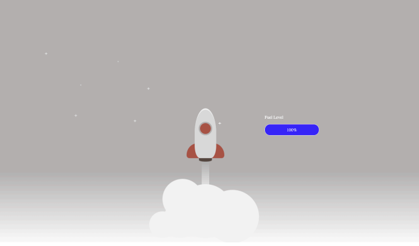

# Hello!

Thank you for accepting our invitation for a technical interview. This guide is aimed at getting
you up and running so you are ready to start the technical challenge as soon as you join your
scheduled interview time.

Alongside this document you will have received an invitation to a private GitHub repository.
This repository is your playground.

1. Start by checking out this repository
2. Once checked out you will note there is CRA project already set-up for you
3. Run `npm install` to install all of the dependencies
4. Run `npm run test` to verify that all tests are passing
5. Verify that the application starts and the “rocket-ship” is viewable in your web browser (http://localhost:3000)

> The screenshot above shows what the application will look like on initial installation

6. Ensure you have an IDE installed that you are familiar with to make modifications to the checked-out code (e.g. Visual Studio, WebStorm etc).

Please familiarize yourself with the applications prior to interview, and make sure you are able to run it locally.

## If you have any problems, please reach out to us prior to your scheduled interview slot so we can aim to resolve any issues.
